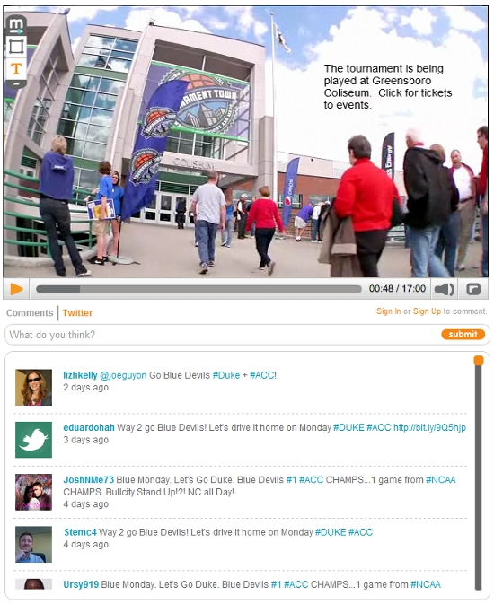
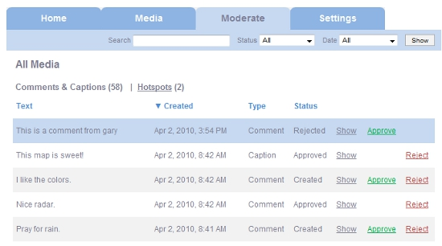

## Mobdub Video Annotation Platform

Mobdub implements the [Synchronized Multimedia Integration Language (SMIL 3.0)](https://www.w3.org/TR/REC-smil/smil30.html) as an API service to support public video annotation and time-synchronized comment streams. A variety of textual annotations can be added to video, including captions and hotspots with corresponding tags and links. Annotations may be positioned anywhere on the video canvas and are synchronized to specific moments in time. Comment streams and social media can also be rendered in sync with the video player timeline.

### Video Annotation and Time-Synchronized Comments

### Contextual Twitter Streams

### Admin Moderation System
